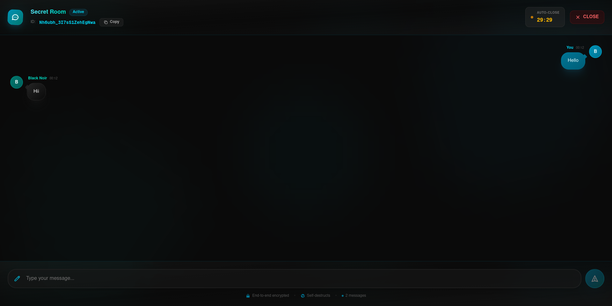

# 🔐 HiddenTalk

HiddenTalk is a **privacy-focused, real-time anonymous chat application** where conversations disappear after the session ends.  
No sign-up. No login. Just share a link and chat.

Built using **Next.js, ElysiaJS, Redis (Upstash), and Vercel**.

---

## Features

-**Anonymous chat** – no sign-in or account required  
-**Auto-destroy rooms** – chats disappear automatically  
-**Limited participants** – prevents overcrowding  
-**Real-time messaging**  
-**Shareable room links**  
-**Redis-backed state management**

---

## Tech Stack

- **Frontend:** Next.js (App Router)
- **Backend:** ElysiaJS
- **Realtime:** WebSockets
- **Database:** Upstash Redis
- **Deployment:** Vercel
- **Styling:** Tailwind CSS

---

## Screenshots

### Home Page


### Chat Room


Screenshots are stored in the `screenshots/` folder.

---

## Environment Variables

Create a `.env.local` file:

```env
UPSTASH_REDIS_REST_URL=your_upstash_url
UPSTASH_REDIS_REST_TOKEN=your_upstash_token
